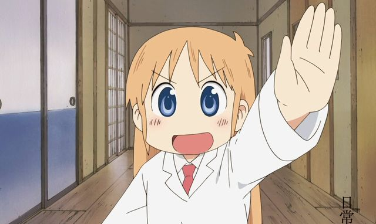

# Gesture HID

**This project still WIP, any advice is welcome**

## Introduction

This is a app can recognize your gesture and trigger specified system operation.
For now it's only a demo, which can only recognize you push you palm to camera, and app will help you press space key.



And this is very useful while you're eating and watching video at same time, because most of players can play/pause by space key.

## Usage
For now we provide source code only, you have to compile by yourself.

You have to prepare opencv and tensorflowlite before compiling.

### Note: Build `tensorflowlite` Library
Clone tensorflow code and run:

```bash
bazel build //tensorflow/lite:tensorflowlite
```

You can find dynamical lib file in `bazel-bin/tensorflow/lite/`

## TODO List
- Process input parameters
    - Trigger delay and palm size threshold
    - IoU threshold and probability threshold
    - Camera ID
- Recognize more gestures
- A GUI to configure the app
- Make bundle
- More system support
    - Win
    - Linux

## Reference
- [List all video devices](https://github.com/studiosi/OpenCVDeviceEnumerator)
- [Media Pipe Palm Detection](https://github.com/shoman2/mediapipe-models/tree/master/palm_detection)

